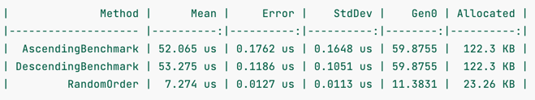
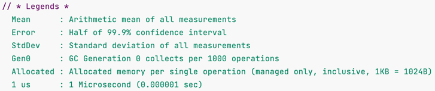
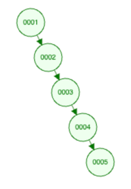

# Benchmark tests using an unbalanced search tree as an example

The background of this example was to deal with generics. 
The task was to create a class that can represent a binary tree.   
Additionally a benchmark test was done to show where the weaknesses 
of a BinaryTree are.

## Node
The class Node is a generic class which has a type constraint.

A node has its own value and two neighbors(left and right).
On the left side are values that are less than the node value and on the 
right side values that are greater than or equal to the node value.

### Type constraint

```public class Node<T> where T : IComparable<T>```

"Constraints inform the compiler about the capabilities a type argument must have. 
Without any constraints, the type argument could be any type. The compiler can only assume the members of System.Object,
which is the ultimate base class for any .NET type." [Microsoft Doc](https://learn.microsoft.com/en-us/dotnet/csharp/programming-guide/generics/constraints-on-type-parameters)

Our class needs the IComparable interface which means only types inherited from the IComparable are allowed.  
IComparable offers the CompareTo method, which can be called to compare the values of different nodes.


### Add

The Add method is responsible for building a BinaryTree. 
When a node is instantiated you can call the Add method to add a value
to the tree. The value at the first instantiation is the root. 

The key behind the Add method is recursion, simply explained it means,
the Add method calls itself when needed. 

Here is a visualization of the add process:


[Tool to create BinaryTrees](https://www.cs.usfca.edu/~galles/visualization/BST.html)

In code form, the process looks something like this:
```
var root = new Node<int>(4);
root.Add(6);
root.Add(1);
root.Add(8);
root.Add(4);
```
#### Implementation
```
    public void Add(T value) {
        if (value.CompareTo(_value) < 0) {
            if (_left is null)
                _left = new Node<T>(value);
            else
                _left.Add(value);
        }
        else {
            if (_right is null)
                _right = new Node<T>(value);
            else
                _right.Add(value);
        }
    }
```
The method is passed a parameter, it is first looked whether the value comes on the left or right side 
(CompareTo is possible, because in the class definition type constraint was specified,
otherwise this would not be possible).

Then it is looked whether the node is an end node, if there is no next node a new node is created and placed at the place.
If there is another node, the Add method is called from this node and the value is passed through, this process is repeated until it is an end node(recursion).


### ToOrderedList

Returns a List of the BinaryTree ordered.

The work is done by a helper method TraverseTree.
``` 
private void TraverseTree(List<T> list) {
        if (_left != null)
            _left.TraverseTree(list);
        
        list.Add(_value);
        
        if (_right != null)
            _right.TraverseTree(list);
    }
```

The method is passed a list where the result is stored.
Again, recursion is used here.

The method works from left to right, because in a BinaryTree the lowest value must always be on the left. 
The method goes to the "lowest" node and then works its way up from the bottom.

### Exists

Used to check if a value exists in the BinaryTree.

``` 
public bool Exists(T value)
    {
        if (value.CompareTo(_value) > 0) {
            if (value.CompareTo(_value) == 0)
                return true;
            
            if (_right is null) 
                return false;
            
            return _right.Exists(value);
        }
        else {
            if (value.CompareTo(_value) == 0)
                return true;
            
            if (_left is null)
                return false;
            
            return _left.Exists(value);
        }
    }
```

First, the method checks whether the input value is equal to the value of the current node and returns true if it is.  
If the input value is greater than the value of the node, the method searches recursively in the right side of the tree.   
If the input value is less than the value of the node, it searches in the left subtree.   
If there is no suitable subtree (node) it returns false.

## NodeBenchmark

This class has 3 variables:
1. to store random generated numbers
2. to store sorted numbers ascending
3. to store sorted numbers descending

The assignment is done in the constructor, so that the benchmark is not distracted later.

Furthermore, there are three methods that are responsible for the actual benchmark.
There BinaryTrees are created with the previously defined variables.

And our concern here is the difference between the results among the differently sorted lists.



As you can see, the two sorted lists take much longer than the random ones.

But why is that?

If we imagine a sorted list and have our Add method in mind, what happens is that when the list is sorted in ascending order, the next value is always larger than the previous one, so the tree always has values only on the right side only.

  
Which then looks something like this. 

I think this is where the problem becomes very apparent, we needed a lot of power to run through each node instance to add or search for another node for example.

Let's move on to the random sorted tree, this one is much faster, if you have the previously mentioned point in mind you can see it.   

Since the values are randomly thrown together, there is a certain width of the values which makes the tree grow to the left and to the right.  

Furthermore, if a value has to be searched for, since values are distributed left and right, the search process is reduced to half for each node until the searched value can finally be found.

## Conclusion

This benchmark showed that an efficient BinaryTree must always be well balanced. 
Unbalanced ones can lead to performance problems.
[Read more](https://en.wikipedia.org/wiki/Self-balancing_binary_search_tree)